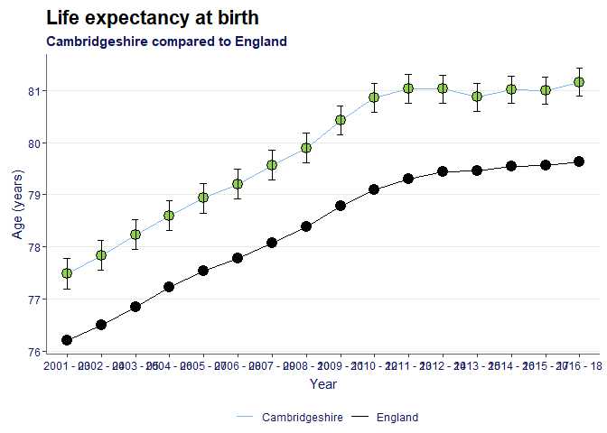
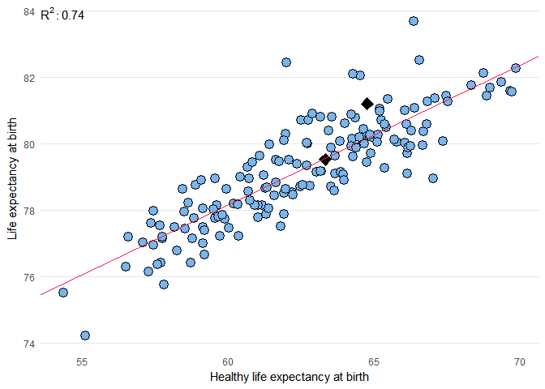
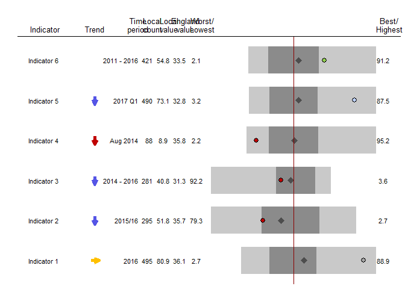

<!-- README.md is generated from README.Rmd. Please edit that file -->

[](https://travis-ci.org/PublicHealthEngland/fingertipscharts)
[](https://coveralls.io/github/PublicHealthEngland/fingertipscharts?branch=master)

[](https://cran.r-project.org/package=fingertipscharts)
[](https://cran.r-project.org/package=fingertipscharts)
[](https://cran.r-project.org/package=fingertipscharts)

# fingertipscharts

This is an R package to help users to easily reproduce charts that are
displayed on Public Health England’s
[Fingertips](http://fingertips.phe.org.uk/) data tool. Along with the
`fingertipsR` package, this package can be used to help users bring the
data on the website into their own outputs.

## Installation

### CRAN

Get the latest released, stable version from CRAN:

``` r
install.packages("fingertipscharts")
```

### With remotes

You can install the latest development version from github using
[remotes](https://github.com/r-lib/remotes):

``` r
# install.packages("remotes")
remotes::install_github("PublicHealthEngland/fingertipscharts",
                        build_vignettes = TRUE)
```

## Example of some visualisations

Here are some examples of visualisations the package provides. See the
[vignette](https://cran.r-project.org/package=fingertipscharts/vignettes/quick_charts.html)
for a more comprehensive overview.

### Trends

``` r
library(fingertipscharts)
library(dplyr)

# Create the data to plot
df <- create_test_data() %>%
        arrange(IndicatorName) %>%
        mutate(Timeperiod = rep(c("2011", "2012", "2013", "2014", "2015", "2016"),
                                each = 111))
country_val <- df %>%
  filter(AreaCode == "C001") %>%
  select(Timeperiod, Country_val = Value)

# add the signifance for the local area points compared to the comparator
df <- df %>%
  left_join(country_val, by = "Timeperiod") %>%
  mutate(Significance = case_when(
    LCI > Country_val ~ "Higher",
    UCI < Country_val ~ "Lower",
    TRUE ~ "Similar"
  ))

# plot the trends

p <- trends(df,
            timeperiod = Timeperiod,
            value = Value,
            area = AreaCode,
            comparator = "C001",
            area_name = "AC103",
            fill = Significance,
            lowerci = LCI,
            upperci = UCI,
            title = "Title of graph",
            subtitle = "AC103 compared to C001",
            xlab = "Year",
            ylab = "Unit of measurement")
p
```

<!-- -->

### Compare indicators

``` r
# Create the data to plot, filtering for areas within a single parent, and also the parent and the national area
region <- "PAC10"
top_names <- c("C001", region)
df <- create_test_data() %>%
  filter(IndicatorName == "Indicator 3",
         (ParentAreaCode == region |
            AreaCode %in% top_names))

# order the factor for the significance field so they appear in the legend in the desired order
ordered_levels <- c("Better",
                    "Similar", 
                    "Worse",
                    "Not compared")
df <- df %>%
        mutate(Significance = 
                       factor(Significance,
                              levels = ordered_levels))

# plot compare areas chart
p <- compare_areas(df,
                   AreaCode, 
                   Value,
                      fill = Significance,
                      lowerci = LCI,
                      upperci = UCI,
                      order = "desc",
                      top_areas = top_names,
                      title = unique(df$IndicatorName))
p
```

<!-- -->

# Area profiles

``` r
dfspine <- create_test_data()
p <- area_profiles(dfspine,
                   value = Value,
                   count = Count,
                   area_code = AreaCode,
                   local_area_code = "AC122",
                   indicator = IndicatorName,
                   timeperiod = Timeperiod,
                   trend = Trend,
                   polarity = Polarity,
                   significance = Significance,
                   area_type = AreaType,
                   median_line_area_code = "C001",
                   comparator_area_code = "PAC12",
                   datatable = TRUE,
                   relative_domain_text_size = 0.75,
                   relative_text_size = 1.2,
                   bar_width = 0.68,
                   indicator_label_nudgex = -0.1,
                   show_dividers = "outer",
                   header_positions = c(-1, -0.7, -0.44, -0.35, -0.25,
                       -0.15, -0.05, 1.08))
p
```

<!-- -->
